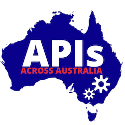

# How To Join The Online Meetup | May 29th, 12 pm (noon) AET.

## Dial-In Information & Live Stream

### Join us in the (virtual) room

Show your face, be present – it's a meetup! We're using ZOOM for that. Please read the info below.

### Or just watch the Live Stream

Watch the event on any device that has YouTube on it. You can still ask questions in the chat room.

### Agenda & Event Info
Just in case you haven't seen this yet, click here. Please register for the event so we can send you updates via email.

# Do this before the event:

## Step 1: Get Ready for Zoom

To give you the best experience, whether you're mobile or at your desk, we've decided to use Zoom. It runs on your phone, tablet, or as a desktop application. If you cannot install software on your machine, click the 'join using my browser' button when dialing in.

## Step 2: Test Your Setup

Try this before our event starts and check if your device & your audio works!

